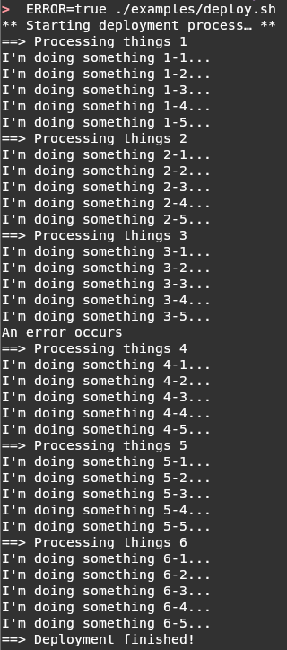

# StreamStepper

A Go-based CLI tool that **parses shell command output to render it formatted** in a beautiful terminal UI (TUI) with a **dynamic progress bar**.

StreamStepper intercepts `stdout` and `stderr` from your scripts. It listens for specific trigger strings to:
- **increment a progress bar** to follow the progress of the process
- **extract status messages** to report what is doing
- **colorize messages** depending on whether they are in `stdout`, `stdin` or flagged with a specific sequence of characters
- **indent logs** for better reading

while keeping the raw logs available in a scrollable view.

## Without StreamStepper


## With StreamStepper


## Installation

Ensure you have Go installed, then compile the binary.

```bash
git clone https://github.com/pivaldi/stream-stepper.git
cd stream-stepper
go build -o stream-stepper main.go

# Optional: move to your binary path
sudo mv stream-stepper /usr/local/bin/
```

**If you do not want to install `stream-stepper`**, replace the command `stream-stepper` by `go run .`

## How It Works

StreamStepper scans text line-by-line. If a line beginnings by the trigger flag (default: `==>`), three things happen:

1. The progress bar increments by 1 step.
2. The line is colorized in blue.
2. Any text following the flag on that same line is displayed as the current status message in the bottom panel.

All other output is printed indented by one tabulation in the main scrolling window.

## Usage

### Command-Line Flags

* `--steps` (Required): Total number of steps required to reach 100%.
* `--flag` (Optional): The string trigger to look for. Default is `==>`.
* `--tagged` (Optional): Boolean flag to read from `stdin` expecting `[OUT]` and `[ERR]` prefixes.
* `--err-fifo` (Optional): Path to a named pipe to read `stderr` from.
---

### Operating Modes

StreamStepper supports three ways to route your data:

#### 1. Exec Mode (Default)

Pass the command as an argument. StreamStepper executes it as a child process and handles `stdout` and `stderr` automatically.

```bash
stream-stepper --steps=7 ./examples/deploy.sh

```

#### 2. Standard Pipe Mode

Pipe data directly into StreamStepper.
**Note:** as pipe redirect `stderr` to `stdout`, StreamStepper can not capture errors with this usage.

```bash
./examples/deploy.sh 2>&1 | stream-stepper --steps=7

```

#### 3. Tagged Pipe Mode (Separated stdout/stderr)

If you want to pipe data but keep `stderr` visually distinct (rendered in red), you can use Bash to tag the streams before they enter the UI.
In this case as `sed` blocks buffering, the parsing is not realtime.

```bash
{ ./examples/deploy.sh 2>&1 1>&3 | sed 's/^/[ERR] /' >&2; } 3>&1 1>&2 | sed 's/^/[OUT] /' | stream-stepper --steps=7 --tagged

```

To fix unbuffered `sed` using `GNU sed`:

```bash
{ stdbuf -oL -eL ./examples/deploy.sh 2>&1 1>&3 | \
    sed -u 's/^/[ERR] /' >&2; } 3>&1 1>&2 | \
    sed -u 's/^/[OUT] /' | \
    stream-stepper --steps=7 --tagged

```

#### 4. FIFO Mode (Named Pipes)

Route `stderr` through a named pipe, and `stdout` through the standard pipe.

```bash
mkfifo err_pipe && {
    ./examples/deploy.sh 2> err_pipe | stream-stepper --steps=7 --err-fifo="err_pipe"
    rm err_pipe
}
```

## Try the Examples

Try the example script:
- `go run . --steps 7 ./examples/deploy.sh`
- `ERROR=true go run . --steps 7 ./examples/deploy.sh`
- `EXIT=true go run . --steps 7 ./examples/deploy.sh`

## Dependencies

* [tview](https://github.com/rivo/tview) - Terminal UI library
* [tcell](https://github.com/gdamore/tcell) - Terminal handling
